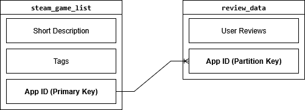
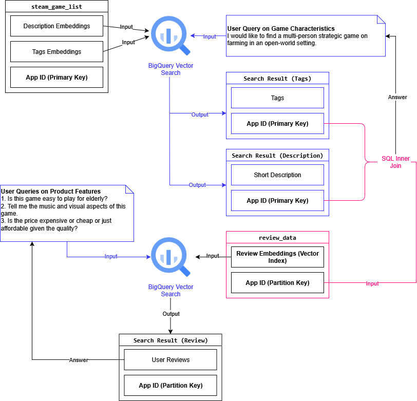

# Automated Product Positioning Tools: Steam Game
*Foreword*: This `ReadMe.md` serves as a blog post for submission to the 2025 Google Cloud's Hackathon "**BigQuery AI - Building the Future of Data**". This submission follows "Approach 2: The Semantic Detective 🕵️‍♀️".

*Official page*: https://www.kaggle.com/competitions/bigquery-ai-hackathon/overview

## Background

### Business Question
Performing product positioning in real-time is often required in the current fast-paced environment in particular products with short life cycles. 
A vivid example is the video game industry. 
According to [SteamDB](https://steamdb.info/stats/releases/), there are 18,641 games released on Steam in 2024. 
The business question relevant in this setting, to both developers and analysts, is *how to understand the position of your game in the global market, whether you are planning to produce a computer game or to analyze an existing game*.

### Pain Point
Let say if you are planning to make a horror game, you would like to know what kind of horror games are available in the market, and how their buyers perceive the quality of horror games. 
Currently, product or market analysts are conducting their analysis through manual reviews of unstructured data such as game description and user comments. 
Furthermore, it is hard for analysts to understand foreign markets because of language barriers.
The manual process can be broken down into two steps:

1. Identify computer games with similar characteristics based on their tags on Steam.
2. Review user comments based on how many people think it is "helpful" or the time of posting the comment. 

As such, an automated solution using LLM-based text embedding models is proposed.

## Public Dataset
Our solution is based on two _public_ datasets on Kaggle:

1. `steam_game_list` A complete list of Steam games (40.21 MB, 55.7k records): [All 55,000 Games on Steam (November 2022)](https://www.kaggle.com/datasets/tristan581/all-55000-games-on-steam-november-2022)
2. `review_data` A list of game reviews (8.17 GB, 21.7m records): [Steam Reviews Dataset 2021](https://www.kaggle.com/datasets/najzeko/steam-reviews-2021)

The data files are stored in Cloud Storage and then loaded to BigQuery according to the [schema](/schema/).

## Solution

### Automated Workflow
Our solution is based on Vector Search in SQL because it can be integrated easily as a backend process in deployment.
The embedding model is `text-embedding-004`.
The automated workflow is sequential in design which accepts user queries in two steps:

The first user query is used to retrieve games satisfying the semantic description of game characteristics or elements e.g.

+ I would like to find a multi-person strategic game on farming in an open-world setting.
+ I would like to find a multi-person action RPG game with dragon

Vector search is applied to textual fields in the first dataset consisting of a complete list of Steam games. 
To ensure accurate matching, two columns from the first dataset is used to create embeddings: `short description` and `tags`. 
A game will be returned as a result only if the semantic meaning of both game descriptions and tags are highly relevant to the user query.
Technically, it is done by an inner join of two tables created by vector-searching two embeddings.

The second user query is used to explore user comments based on the previous extracted list of games.
It automates the analysis of customer perceptions of product features across multiple countries e.g.

+ Is this game easy to play for elderly?
+ Tell me the music and visual aspects of this game.
+ Is the price expensive or cheap or just affordable given the quality?

Vector search is applied to `review` column in the second dataset consisting of user comments of some Steam games. 
This automated workflow based on vector search successfully addresses the abovementioned pain points. 

The accuracy of identifying games with specified genre and characteristics improves.
Second, user comments are retrieved based on semantic meaning but not number of likes.

### Data Model

The connection between `steam_game_list` and `review_data` is the Steam ID of each game `App ID`.
It is a unique primary key for `steam_game_list` and `review_data` is partitioned by `App ID` to reduce cost in joining tables.

### Architecture Diagram

### Demo
The exact implementation can be found in the [notebook](./prototype.ipynb)

## Metrics

## Runtime
